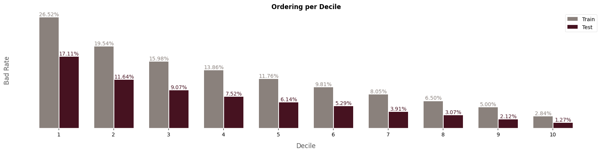
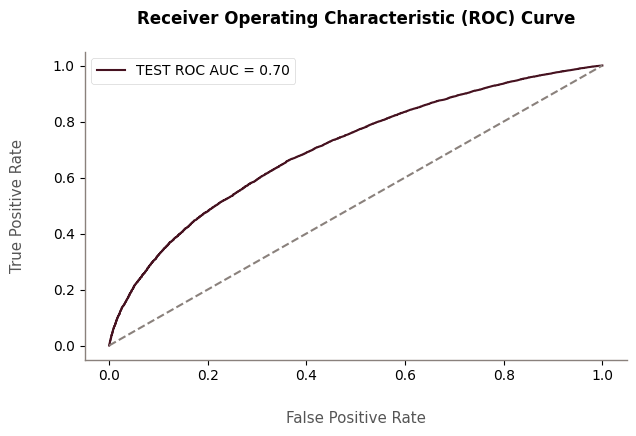

# Portfolio-Ciencia-de-Dados

# Bem-vindo ao meu portfólio de ciência de dados!

  

Olá! Meu nome é Pedro Almeida e eu sou um estudante de 20 anos cursando Bacharelado em Engenharia de Computação na Universidade Federal de Brasília. Atualmente, trabalho como Cientista de Dados Estagiário na Mundiale. Nesse papel, auxilio na análise e interpretação de conjuntos de dados, extraindo insights valiosos. Colaboro com equipes multidisciplinares para identificar e implementar melhorias nos processos de dados. Contribuo no desenvolvimento de modelos de Processamento de Linguagem Natural (NLP) para análise de dados textuais, além de outros modelos para propensão de compra e previsão de vendas, por exemplo. Ofereço apoio à equipe na análise crítica de resultados obtidos por modelos de Machine Learning, influenciando decisões baseadas em dados. Executo testes A/B para validar hipóteses e otimizar a performance de modelos preditivos e participo ativamente na criação de visualizações de dados e na elaboração de relatórios detalhados. Minha paixão está em machine learning, ciência de dados, estatística e matemática, e estou constantemente trabalhando em projetos nessas áreas. Explore-os abaixo!

## Projetos

## ANÁLISE EXPLORATÓRIA DE DADOS, CLASSIFICAÇÃO E REGRESSÃO

### [**Análise e modelagem dos microdados do enem 2022**](https://github.com/allmeidaapedro/Enem-Analysis)

- **Descrição:** Este é um projeto de ciência de dados de ponta a ponta (da coleta de dados até o deploy), no qual são realizadas a limpeza de dados, análise exploratória e modelagem de microdados do ENEM 2022 (dados públicos reais).
- **Problema e objetivos:** O objetivo consiste em realizar uma análise e modelagem do desempenho e da abstenção no exame. A análise e modelagem de desempenho tem como objetivo identificar a relação das variáveis com a nota do aluno e construir um modelo de Regressão Lasso para predição dessa nota e entendimento do impacto das variáveis nela. A análise e modelagem de abstenção tem como objetivo identificar a relação das variáveis com a abstenção do aluno e construir um modelo de Regressão Logística para predição da probabilidade de um aluno se abster no exame, além de interpretar a razão de chances nessa probabilidade com base em diferentes comparações, como alunos de escola pública vs particular.
- **Resultados:** Foram percebidas relações lineares monotônicas interessantes, como, quanto maior era a escolaridade da mãe do candidato, maior era o desempenho e menor a taxa de abstenção. Os modelos tiveram performances satisfatórias. Com um MAE = 57, em média, as predições do modelo de regressão desviam das notas reais dos alunos em 57 pontos. Com um ROC-AUC = 0.68, há um poder discriminatório em distinguir alunos que compareceram e que faltaram. Analisando os coeficientes, a chance de se abster no exame para quem estudou em escola privada diminuem em 65%. Além disso, para cada aumento de uma unidade na renda familiar mensal, a nota geral do aluno aumenta em 16 pontos. Foram desenvolvidas duas APIs Flask para deploy dos modelos de ambas as análises supracitadas. Dessa forma, é possível prever a nota ou a probabilidade de abstenção de um candidato fornecendo dados socioeconômicos e educacionais sobre ele.
- [Clique aqui para conferir o projeto completo](https://github.com/allmeidaapedro/Enem-Analysis)
- Alguns insights:
  
   

  
  

  
    

    
    

      
- Alguns resultados obtidos e validação do modelo;
  

  

- Deploy;

  

  

## CLASSIFICAÇÃO E REGRESSÃO

### [**Modelagem de Risco de Crédito (PD, EAD, LGD, EL) - Lending Club**](https://github.com/allmeidaapedro/Lending-Club-Credit-Scoring)
- **Descrição:** Neste projeto, realizo a modelagem de risco de crédito, englobando modelos de Probability of Default (PD), Exposure at Default (EAD), Loss Given Default (LGD) e Expected Loss (EL), utilizando dados de empréstimos de 2007 a 2014 da instituição americana Lending Club.
- **Problema de negócio:** O Lending Club enfrenta um grande desafio em gerenciar riscos de perda enquanto otimiza o lucro para seus investidores. A plataforma espera estimar riscos acuradamente para manter um negócio sustentável e lucrativo. Então, o CEO deseja obter insights sobre o risco de crédito nas concessões da empresa, e que sejam construídos modelos de PD, EAD e LGD, para estimar a perda esperada (EL) em cada empréstimo. Isso, juntamente a scores de crédito, será utilizado para desenvolver possíveis políticas de crédito na empresa. Ademais, sendo uma plataforma online, é importante explicar para os clientes o porquê da decisão de aprovar ou negar um empréstimo. Então, os resultados desses modelos devem ser explicáveis e interpretáveis.
- **Objetivos:** Desenvolver modelos de PD, EAD e LGD, de forma a computar a perda esperada em cada empréstimo, EL. A partir disso, desenvolver uma política de crédito considerando as perdas estimadas e o ROI anualizado de cada ativo. Então, monitorar o modelo, acessando indicadores de estabilidade populacional, aferindo a necessidade de um novo modelo um ano após o construído.
- **Resultados:** O modelo de PD obteve boa capacidade discriminatória, com AUC = 0.7 e KS = 0.3, além de ordenação nos escores, concentrando mais de 50% dos maus clientes até a terceira faixa de score. Os modelos de LGD e EAD obtiveram poder preditivo satisfatório. A política de crédito foi desenvolvida e reduziu em quase 11% as perdas esperadas e também a taxa de inadimplência. O modelo foi monitorado e foi aferida a necessidade, em breve, de desenvolvê-lo novamente, pois os scores apresentaram um PSI de 0.19.
- [Clique aqui para conferir o projeto completo](https://github.com/allmeidaapedro/Lending-Club-Credit-Scoring)

- Alguns resultados obtidos e validação do modelo;

  

  

### [**Previsão de Churn de Cartão de Crédito**](https://github.com/allmeidaapedro/Churn-Prediction-Credit-Card)
- Este é um projeto de machine learning de ponta a ponta (da coleta de dados à Deploy) que utiliza XGBoost para prever a probabilidade de um cliente cancelar o serviço de cartão de crédito de um banco.
- Identificar possíveis clientes propensos a cancelar ajuda a planejar estratégias de retenção, mantendo uma receita saudável. Adquirir um novo cliente é mais caro do que manter um existente.
- Os principais objetivos foram: identificar os fatores associados ao churn do cliente; construir um modelo capaz de prever o maior número possível de possíveis canceladores; oferecer planos de ação para o banco reduzir o churn de clientes de cartão de crédito.
- Foi possível obter um ganho estimado de $198,098.82, calculando a diferença entre o ganho de verdadeiro positivos, o custo de retenção de falsos positivos e o custo de falsos negativos que cancelam.
- [Clique aqui para conferir o projeto completo](https://github.com/allmeidaapedro/Churn-Prediction-Credit-Card)

- Algumas análises realizadas;

  

- Deploy;

  

## REGRESSÃO / SÉRIES TEMPORAIS

### [**Previsão de Demanda de Itens de Loja**](https://github.com/allmeidaapedro/Store-Item-Demand-Forecasting)
- Neste projeto, realizei previsão de séries temporais usando o LightGBM para prever as vendas de 50 itens em 10 lojas diferentes ao longo de um período de 3 meses.
- Ao fazer isso, a empresa poderá gerenciar estrategicamente o estoque e alocar recursos de forma eficaz, maximizando a receita e o lucro geral.
- O resultado financeiro por loja, por loja e item, e para a empresa total está presente no projeto.
- [Clique aqui para conferir o projeto completo](https://github.com/allmeidaapedro/Store-Item-Demand-Forecasting)

- Algumas análises realizadas;

  

- Resultados do modelo;

  

## CLUSTERIZAÇÃO

### [**Segmentação de Clientes e Programa de Fidelidade para Loja de Varejo**](https://github.com/allmeidaapedro/Customer-Segmentation-Retail)
- Neste projeto, realizei uma tarefa de clusterização de aprendizado não supervisionado usando o K-Means em dados de treinamento não rotulados para segmentar e perfilar clientes de uma loja de varejo.
- Após segmentar os clientes, um programa de fidelidade chamado "Prosperous" foi desenvolvido com base no perfil de nossos melhores clientes, os Prosperous.
- O programa de fidelidade tem o potencial de aumentar a receita total da loja em 9%, totalizando $125,228.55. Portanto, o projeto é válido.
- [Clique aqui para conferir o projeto completo](https://github.com/allmeidaapedro/Customer-Segmentation-Retail)

- Clusterização;

  

- Resultados do modelo;

  

## ANÁLISE EXPLORATÓRIA DE DADOS

### [**Loja Olist**](https://github.com/allmeidaapedro/Olist-Analysis)
- Neste projeto, realizei uma análise exploratória de dados de uma empresa de e-commerce brasileira, a Olist. Algumas perguntas de negócios foram formuladas e respondidas por meio de técnicas envolvendo coleta, limpeza, exploração e visualização de dados.
- [Clique aqui para conferir o projeto completo](https://github.com/allmeidaapedro/Olist-Analysis)
- Algumas perguntas de negócios interessantes que foram respondidas incluem:
- 1. As vendas cresceram ao longo de dois anos, atingindo seu pico em novembro de 2017, provavelmente devido à Black Friday. Além disso, é perceptível que após esse pico em 2017, as vendas tendem a se manter em um número alto em comparação com os anos anteriores.

  

- 2. Os estados das regiões Sul e Sudeste concentram os maiores números de pedidos, clientes e vendedores. Em particular, o estado de São Paulo e sua capital apresentam valores mais altos do que todos os outros. Enquanto isso, estados nas regiões Norte e Nordeste mostram os indicadores mais baixos.

  

## EM DESENVOLVIMENTO
- Atualmente, estou me aprofundando em modelagem de crédito e MLOPS.

## CONTATO
* [LinkedIn](https://www.linkedin.com/in/pedro-almeida-ds/)
* [GitHub](https://github.com/allmeidaapedro)
* [E-mail](pedrooalmeida.net@gmail.com)
