# Portfolio-Ciencia-de-Dados

# Bem-vindo ao meu portfólio de ciência de dados!

  

Olá! Meu nome é Pedro Almeida e eu sou um estudante de 20 anos cursando Bacharelado em Engenharia da Computação na Universidade Federal de Brasília. Atualmente, trabalho como estagiário em análise quantitativa na Disrux e Arthur Mining. Nesse papel, realizo análises quantitativas em diversas áreas do mercado financeiro, incluindo criptomoedas, blockchain e investimentos. Aplico análise de dados, visualização e storytelling usando Python e métodos estatísticos. Além disso, contribuo ativamente para minha equipe desenvolvendo ferramentas, soluções e modelos de machine learning para aprimorar a análise de mercado. Minha paixão está em machine learning, ciência de dados e matemática, e estou constantemente trabalhando em projetos nessas áreas. Explore-os abaixo!

## PROJETOS

## ANÁLISE EXPLORATÓRIA DE DADOS, CLASSIFICAÇÃO E REGRESSÃO

### [**Análise e modelagem dos microdados do enem 2022**](https://github.com/allmeidaapedro/Enem-Analysis)

- Este é um projeto de ciência de dados de ponta a ponta (da coleta de dados até o deploy), no qual são realizadas a limpeza de dados, análise exploratória e modelagem de microdados do ENEM 2022 (dados públicos reais). ENEM (Exame Nacional do Ensino Médio) é um exame nacional padronizado no Brasil usado para admissão em universidades e avaliação da educação no ensino médio.
- A limpeza foi fundamental, dado que o conjunto original dos microdados tem mais de 2 GB de tamanho, tornando a manipulação, análise e modelagem dos dados inviável. Ao final dela, foi possível obter um arquivo parquet, reduzindo o tamanho do dataset original de +2 GB para +221.7 MB, quase 10%.
- A análise e modelagem se dividem em duas abordagens:
  - Análise e modelagem de desempenho: O objetivo dessa análise consiste em identificar as principais variáveis que impactam a nota do candidato, entender como elas se relacionam com o         desempenho e utilizá-las para prever a nota. Para a tarefa de predição, é utilizado um modelo de Regressão Lasso, devido às características de interpretabilidade (coeficientes),              regularização e seleção de variáveis, reduzindo os coeficientes daquelas irrelevantes a zero, gerando um modelo esparso. Além disso, foi percebida uma certa relação linear das features com   o target. Por exemplo, quanto maior era a escolaridade da mãe do candidato, maior era o desempenho, de forma monotônica. Esse fator, juntamente à ausência de multicolinearidade favoreceu a   escolha de tal modelo linear.
  - Análise e modelagem de abstenção: O objetivo dessa análise consiste em identificar os principais fatores que influenciam a ausência do candidato na prova. Além disso, ela visa observar     como esses fatores se relacionam com a abstenção e prever a probabilidade de abstenção do estudante. Para a tarefa de predição, é utilizado um modelo de Regressão Logística, devido às        características de interpretabilidade (coeficientes exponenciais representando a razão de chances), regularização através de penalidade l1, hiperparâmetro class_weight e eficiência de        treinamento e predição. Além disso, foi percebida uma certa relação linear das features com o target. Por exemplo, quanto maior era a escolaridade da mãe do candidato, menor era a taxa       abstenção, de forma monotônica. Esse fator, juntamente à ausência de multicolinearidade favoreceu a escolha de tal modelo linear.
- Foram desenvolvidas duas APIs Flask para deploy dos modelos de ambas as análises supracitadas. Dessa forma, é possível prever a nota ou a probabilidade de abstenção de um candidato fornecendo dados socioeconômicos e educacionais sobre ele.
- [Clique aqui para conferir o projeto completo](https://github.com/allmeidaapedro/Enem-Analysis)
- Algumas descobertas interessantes incluem:
- 1. Analisando os coeficientes da Regressão Lasso, o aumento de uma unidade em possui_computador_em_casa, ou seja, de nenhum para um, ou de um para dois ou mais, reflete um aumento de 9.45 na nota geral, considerando todas as outras variáveis constantes. Isso faz sentido, uma vez que vimos na análise de desempenho que alunos que não possuíam computador em casa apresentavam desempenho menor que os que possuíam.
  
   

  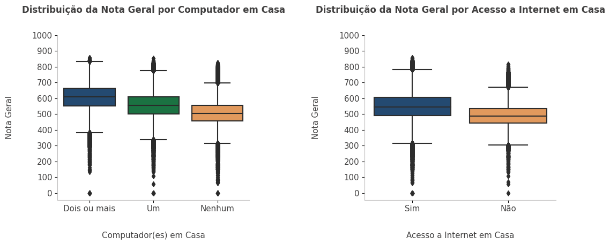
  

  
- 2. Analisando a exponencial dos coeficientes da Regressão Logística (representando a razão de chances), para cada aumento de uma unidade na faixa_etaria (ou seja, de adolescente para jovem adulto, de adulto para meia idade a idoso, por exemplo), as chances de abstenção aumentam em 35%, considerando as outras variáveis constantes. Isso faz sentido, uma vez que vimos na análise de abstenção que a taxa de abstenção entre candidatos adultos, de meia idade e idosos era maior que a de candidatos adolescentes e jovens adultos.
       

      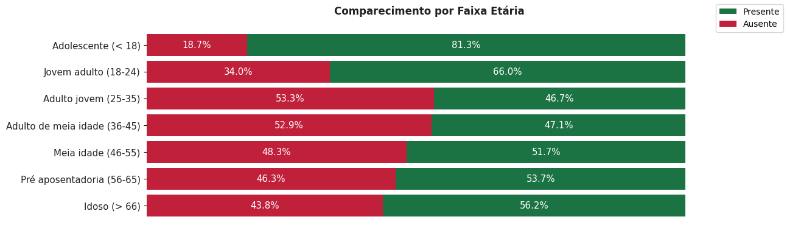
      

      
- Alguns resultados obtidos e validação do modelo;
  

  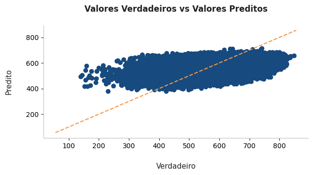

  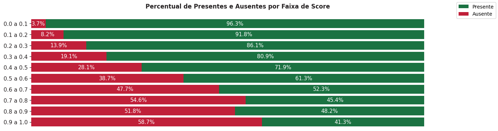

- Deploy;

  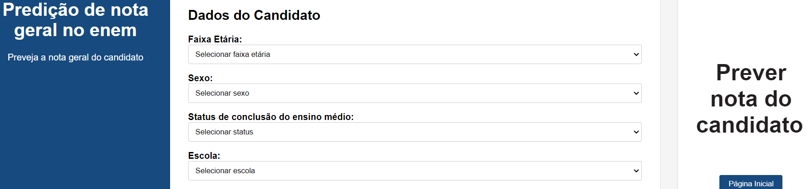

  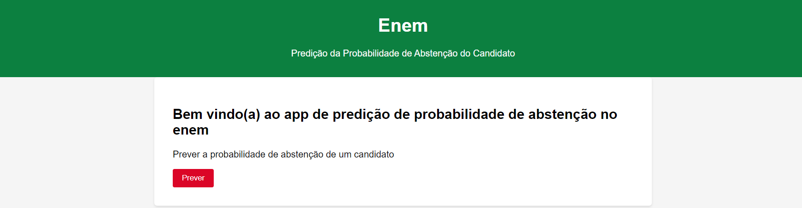

## CLASSIFICAÇÃO

### [**Credit Scoring em Banco Alemão**](https://github.com/allmeidaapedro/Credit-Scoring-German-Bank)

- Este é um projeto de machine learning de ponta a ponta (da coleta de dados à Deploy) que utiliza Random Forest para atribuir pontuações de crédito a potenciais clientes de um banco alemão.
- Dessa forma, é possível tomar decisões informadas, protegendo o Retorno sobre o Investimento (ROI) ao minimizar o risco de crédito.
- Estimei resultados financeiros calculando o ROI usando a receita esperada de empréstimos não inadimplentes, a perda esperada de empréstimos inadimplentes e o montante total de crédito concedido antes da solução e após a mudança na política de crédito do banco com base no meu modelo de pontuação de crédito. Finalmente, após estender o crédito apenas a clientes com pontuação de crédito de 600 ou mais, o ROI aumentou de 9,55% para 42,64%.
- [Clique aqui para conferir o projeto completo](https://github.com/allmeidaapedro/Credit-Scoring-German-Bank)

- Alguns resultados obtidos e validação do modelo;

  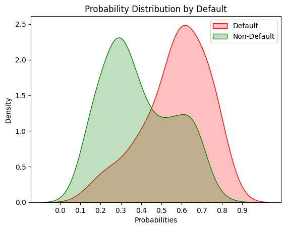

- Deploy;

  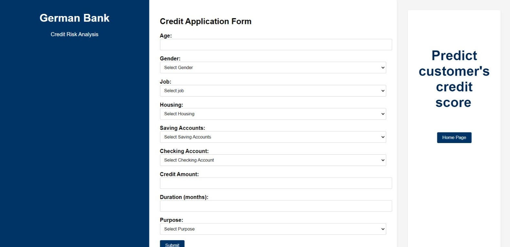

### [**Previsão de Churn de Cartão de Crédito**](https://github.com/allmeidaapedro/Churn-Prediction-Credit-Card)
- Este é um projeto de machine learning de ponta a ponta (da coleta de dados à Deploy) que utiliza XGBoost para prever a probabilidade de um cliente cancelar o serviço de cartão de crédito de um banco.
- Identificar possíveis clientes propensos a cancelar ajuda a planejar estratégias de retenção, mantendo uma receita saudável. Adquirir um novo cliente é mais caro do que manter um existente.
- Os principais objetivos foram: identificar os fatores associados ao churn do cliente; construir um modelo capaz de prever o maior número possível de possíveis canceladores; oferecer planos de ação para o banco reduzir o churn de clientes de cartão de crédito.
- Foi possível obter um ganho estimado de $198,098.82, calculando a diferença entre o ganho de verdadeiro positivos, o custo de retenção de falsos positivos e o custo de falsos negativos que cancelam.
- [Clique aqui para conferir o projeto completo](https://github.com/allmeidaapedro/Churn-Prediction-Credit-Card)

- Algumas análises realizadas;

  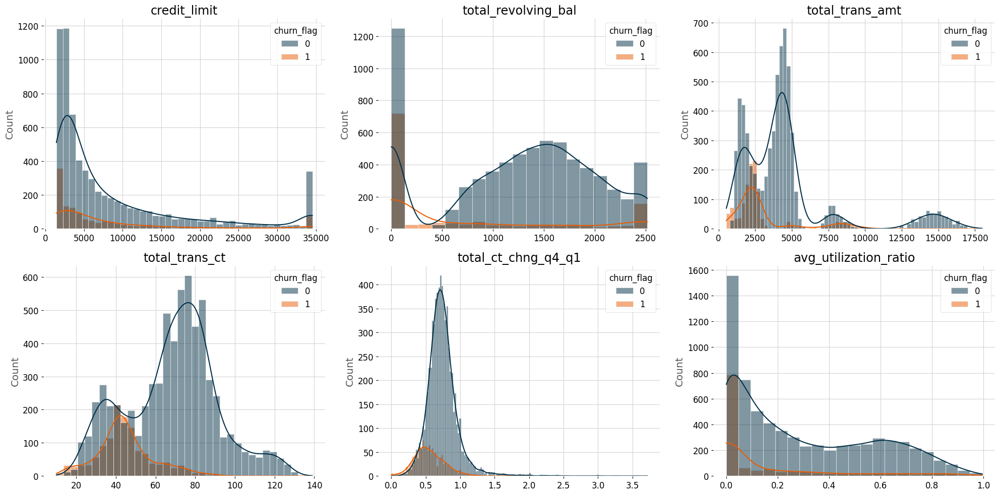

- Deploy;

  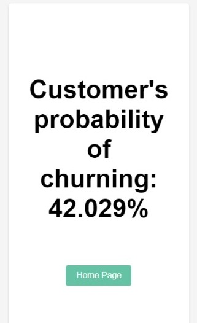

## REGRESSÃO / SÉRIES TEMPORAIS

### [**Previsão de Demanda de Itens de Loja**](https://github.com/allmeidaapedro/Store-Item-Demand-Forecasting)
- Neste projeto, realizei previsão de séries temporais usando o LightGBM para prever as vendas de 50 itens em 10 lojas diferentes ao longo de um período de 3 meses.
- Ao fazer isso, a empresa poderá gerenciar estrategicamente o estoque e alocar recursos de forma eficaz, maximizando a receita e o lucro geral.
- O resultado financeiro por loja, por loja e item, e para a empresa total está presente no projeto.
- [Clique aqui para conferir o projeto completo](https://github.com/allmeidaapedro/Store-Item-Demand-Forecasting)

- Algumas análises realizadas;

  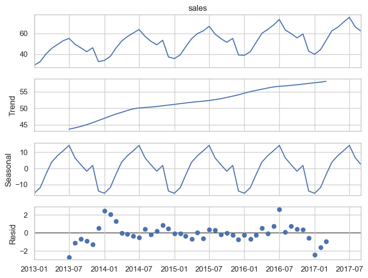

- Resultados do modelo;

  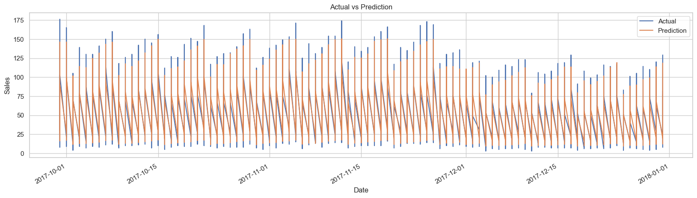

## CLUSTERIZAÇÃO

### [**Segmentação de Clientes e Programa de Fidelidade para Loja de Varejo**](https://github.com/allmeidaapedro/Customer-Segmentation-Retail)
- Neste projeto, realizei uma tarefa de clusterização de aprendizado não supervisionado usando o K-Means em dados de treinamento não rotulados para segmentar e perfilar clientes de uma loja de varejo.
- Após segmentar os clientes, um programa de fidelidade chamado "Prosperous" foi desenvolvido com base no perfil de nossos melhores clientes, os Prosperous.
- O programa de fidelidade tem o potencial de aumentar a receita total da loja em 9%, totalizando $125,228.55. Portanto, o projeto é válido.
- [Clique aqui para conferir o projeto completo](https://github.com/allmeidaapedro/Customer-Segmentation-Retail)

- Clusterização;

  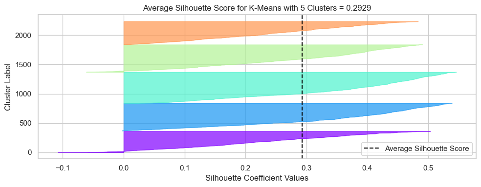

- Resultados do modelo;

  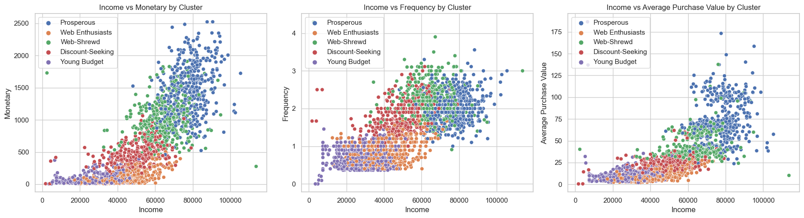

## ANÁLISE EXPLORATÓRIA DE DADOS

### [**Loja Olist**](https://github.com/allmeidaapedro/Olist-Analysis)
- Neste projeto, realizei uma análise exploratória de dados de uma empresa de e-commerce brasileira, a Olist. Algumas perguntas de negócios foram formuladas e respondidas por meio de técnicas envolvendo coleta, limpeza, exploração e visualização de dados.
- [Clique aqui para conferir o projeto completo](https://github.com/allmeidaapedro/Olist-Analysis)
- Algumas perguntas de negócios interessantes que foram respondidas incluem:
- 1. As vendas cresceram ao longo de dois anos, atingindo seu pico em novembro de 2017, provavelmente devido à Black Friday. Além disso, é perceptível que após esse pico em 2017, as vendas tendem a se manter em um número alto em comparação com os anos anteriores.

  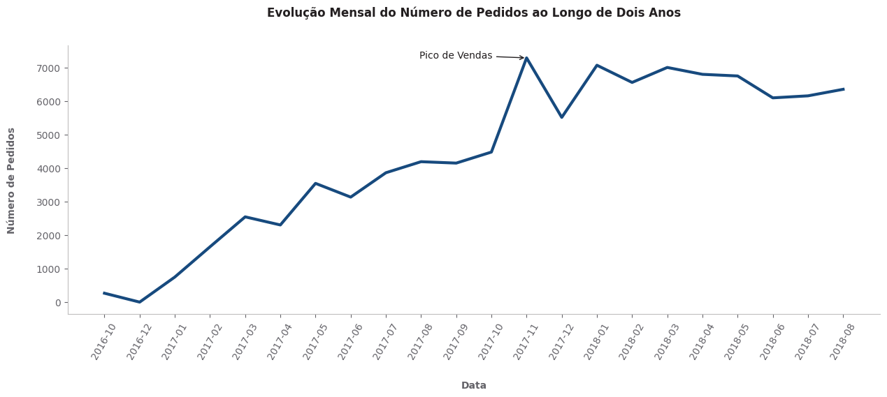

- 2. Os estados das regiões Sul e Sudeste concentram os maiores números de pedidos, clientes e vendedores. Em particular, o estado de São Paulo e sua capital apresentam valores mais altos do que todos os outros. Enquanto isso, estados nas regiões Norte e Nordeste mostram os indicadores mais baixos.

  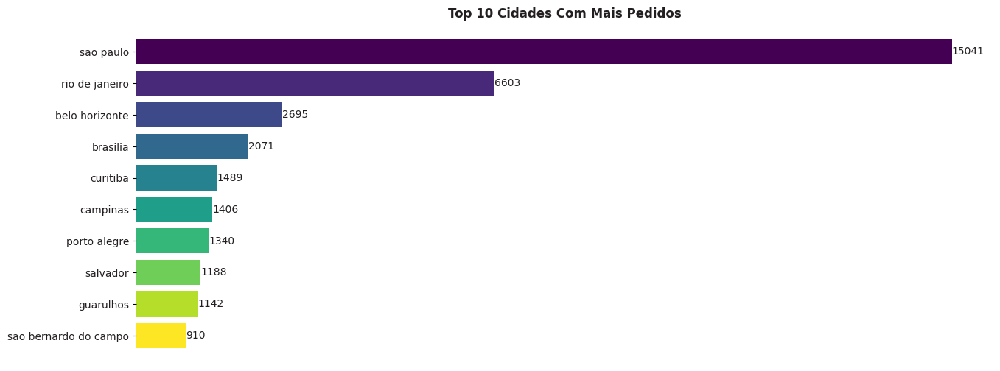

## EM DESENVOLVIMENTO
- Atualmente, estou trabalhando com dados públicos reais do meu país, conduzindo uma análise exploratória de dados do ENEM - o exame mais renomado para estudantes do ensino médio no Brasil.

## CONTATO
* [LinkedIn](https://www.linkedin.com/in/pedro-henrique-almeida-oliveira-77b44b237/)
* [GitHub](https://github.com/allmeidaapedro)
* [E-mail](pedrooalmeida.net@gmail.com)
